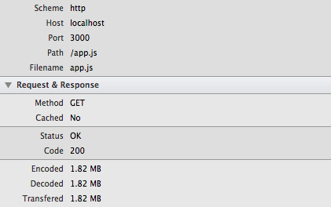
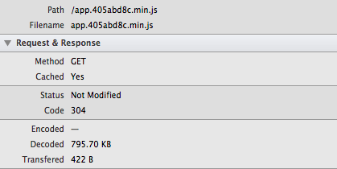

## Client Solutions from <span>Development</span> to <span>Production</span>

[](http://andyet.com)
[](http://caa.com)

[Luke Karrys](http://twitter.com/lukekarrys) **&amp;** [Glenn Scott](http://twitter.com/glennsc)


---


## <span>tour</span>Router

- Single page app (**SPA**)
- App is served by **Node**
- Built on a **Node API**
- Deployed to **Azure**

[](http://nodejs.org/) [](http://windowsazure.com)

Notes:
- Node API + client is all one language, makes developers more productive
- App is just an API client
- An app to help agents/assistants/artists/managers collaborate on all aspects of routing a tour around the world


---


## <span>tour</span>Router Stats

- **9900** lines of custom JS in **113** files
- **1700** lines of jade in **43** files
- **55.1k** lines (1.8MB) of clientside JS
- **3KB** of HTML {.class="fragment"}

Notes:
- Gzips/minifies down to 218KB
- A lot of complexity in a single page app
- We have put a lot of thought into how to keep the development process sane without sacrificing production quality or speed (and vice versa)
- Single page apps can devolve into a mess of code very quickly.
- And what does that look like... 


---


## Our <span>HTML/Jade</span>

```jade
doctype 5
html
  head
    title tourRouter
    //- Meta tags...
    //- App splash images...
    //- Favicons and app icons...
    link(rel='stylesheet', href=cssFileName)
    script(src=jsFileName)
```


---


## The Team<span>(s)</span>

API & Ops  
**Los Angeles**  


Web app: 2 devs  
**Washington, Arizona**  


Notes:
- Clear separation of concerns between teams
- Async communication because of remote
- Real app with real deadlines and stakeholders
- We needed to ship often, rapidly iterate and make deadlines


---


## The <span>Front-End</span>
- [Moonboots](https://github.com/HenrikJoreteg/moonboots) {.class="fragment"}
- [Express](https://github.com/visionmedia/express)/[Resource](https://github.com/visionmedia/express-resource) {.class="fragment"}
- [Browserify](https://github.com/substack/node-browserify) {.class="fragment"}
- [NPM](https://npmjs.org/) {.class="fragment"}
- [Jade](https://github.com/visionmedia/jade)/[Templatizer](https://github.com/HenrikJoreteg/templatizer) {.class="fragment"}
- [Backbone](http://backbonejs.org/) {.class="fragment"}
- [Human JavaScript](http://docs.humanjavascript.com/) {.class="fragment"}

Notes:
- Moonboots is a set of conventions on the server for SPAs. It provides what we need to do caching, minifying, concatenation of assets as well as helpers for routing. It's also very environment aware with sane defaults for development and production.
- Browserify powers much of moonboots and gives us module on the client.
- NPM is where we try to get all of our JS from
- Human Javascript is patterns of large client side apps. Powered by backbone it provides extensions for models, views and collections and helpers to connect all three.
- The importants part isn't the tech, but the patterns the tech allows us to follow easily


---


## Dev <span>Process</span>
- **Don't** optimize against this
- <span class="align">Fast **iteration** loops on</span>
  <span class="stack-holder align align-left" style="width: 400px;">
    <span data-fragment-index="1" class="stack fragment fade-out">local</span>
    <span data-fragment-index="1" class="stack fragment fade-in"><span data-fragment-index="2" class="fragment fade-out">mobile</span></span>
    <span data-fragment-index="2" class="stack fragment fade-in"><span data-fragment-index="3" class="fragment fade-out">development</span></span>
    <span data-fragment-index="3" class="stack fragment fade-in"><span data-fragment-index="4" class="fragment fade-out">staging</span></span>
    <span data-fragment-index="4" class="stack fragment fade-in">production</span>
  </span>
- **Guaranteed** cache priming/busting



Notes:
- Fast iteration (for all environments and deviced)
- How long does it take me to reload this page
- How long until I can see this against real data
- How long until I can test on my iPhone
- Speed should reflect severity of change
- Local === seconds, Dev === minutes, Staging === 10 minutes, Production === 30 minutes
- Guarantedd caching
- Did my change show when I just refreshed?
- If not, how can I be sure it will next time?


---


## Dev <span>Environment</span>
- Switches on **`process.env.NODE_ENV`**
- Concatenates **non-CommonJS** files
- Builds a **Browserified** bundle
- **`onBeforeJS`** & **`onBeforeCSS`** hook


Notes:
- Moonboots is very optimized for developer environment without sacrificing anything in production
- NODE_ENV allows us to easily switch defaults (minify, cache, etc) based on environment
- Support for CommonJS incompatible files (jQuery, jQuery plugins) is nice (but we like CommonJS stuff a lot)
- Browserify provides the magic of an entry file, custom modules, and 3rd party modules into one bundle
- We run a fn to build jade -> vanilla JS functions in the hook
- Build on each request guarantees dev is never looking at stale code


---


## Use a <span>Module Pattern</span>
- We use **CommonJS/Browserify**
- Others use **AMD/RequireJS**
- <span class="align">Structure</span> 
  <span class="stack-holder align" style="width: 235px;">
    <span data-fragment-index="1" class="stack fragment fade-out">collections</span>
    <span data-fragment-index="1" class="stack fragment fade-in"><span data-fragment-index="2" class="fragment fade-out">views</span></span>
    <span data-fragment-index="2" class="stack fragment fade-in"><span data-fragment-index="3" class="fragment fade-out">models</span></span>
    <span data-fragment-index="3" class="stack fragment fade-in"><span data-fragment-index="4" class="fragment fade-out">helpers</span></span>
    <span data-fragment-index="4" class="stack fragment fade-in"><span data-fragment-index="5" class="fragment fade-out">pages</span></span>
    <span data-fragment-index="5" class="stack fragment fade-in">templates</span>
  </span>
  <span class="align">as modules</span>
- <span class="align">Saner</span> 
  <span class="stack-holder align align-left" style="width: 400px;">
    <span data-fragment-index="6" class="stack fragment fade-out">development</span>
    <span data-fragment-index="6" class="stack fragment fade-in"><span data-fragment-index="7" class="fragment fade-out">refactoring</span></span>
    <span data-fragment-index="7" class="stack fragment fade-in"><span data-fragment-index="8" class="fragment fade-out">reuse</span></span>
    <span data-fragment-index="8" class="stack fragment fade-in">overall process</span>
  </span>

Notes:
- CommonJS (and Browserify) fit our use case very well. The build step is seamless and unknown to the developer.
- We structure everything as modules
- Makes it very easy to spec out a model/view/template and refactor later into more reusable parts


---


## Use <span>NPM</span>
- Install clientisde code from **NPM**
- <span class="align">`npm install`</span> 
  <span class="stack-holder align" style="width: 250px;">
    <span data-fragment-index="1" class="stack fragment fade-out">`backbone`</span>
    <span data-fragment-index="1" class="stack fragment fade-in"><span data-fragment-index="2" class="fragment fade-out">`async`</span></span>
    <span data-fragment-index="2" class="stack fragment fade-in"><span data-fragment-index="3" class="fragment fade-out">`lodash`</span></span>
    <span data-fragment-index="3" class="stack fragment fade-in">`moment`</span>
  </span>
  <span class="align">` --save`</span>
- <span class="stack-holder align" style="width: 233px;">
    <span data-fragment-index="1" class="stack fragment fade-out">`backbone`</span>
    <span data-fragment-index="1" class="stack fragment fade-in"><span data-fragment-index="2" class="fragment fade-out">`async`</span></span>
    <span data-fragment-index="2" class="stack fragment fade-in"><span data-fragment-index="3" class="fragment fade-out">`lodash`</span></span>
    <span data-fragment-index="3" class="stack fragment fade-in">`moment`</span>
  </span>
  <span class="align">` = require('`</span>
  <span class="stack-holder align" style="width: 220px;">
    <span data-fragment-index="1" class="stack fragment fade-out">`backbone`</span>
    <span data-fragment-index="1" class="stack fragment fade-in"><span data-fragment-index="2" class="fragment fade-out">`async`</span></span>
    <span data-fragment-index="2" class="stack fragment fade-in"><span data-fragment-index="3" class="fragment fade-out">`lodash`</span></span>
    <span data-fragment-index="3" class="stack fragment fade-in">`moment`</span>
  </span>
  <span class="align">`')`</span>
- Moonboots can handle **anything else**
- Send [Univeral Module Definition](https://github.com/umdjs/umd/blob/master/returnExports.js) **PRs :)**

Notes:
- As much as possible we try to get clientside libraries from NPM
- Reusable between server and client
- Extremely easy to find and get a module into your dev and production envs
- We are not restricted. Moonboots can handle non CommonJS modules. But it is so much nicer to use all code from NPM.


---


## A <span>Client</span> Page

```javascript
// pages/saveShow.js
var Page = require('./base'); // Our base page module
var Show = require('../models/show'); // Our show module
var async = require('async'); // Lodash, from NPM

// Exporting our saveShow page module
module.exports = P.extend({
  initialize: function () {
    this.model = new Show();
  },
  render: function () {/* ...code... */}
});
```

Notes:
- 


---


## Continuous <span>Deployments</span>

- A commit is a **push**
- A branch is an **environment**

&nbsp;

> "Works on my machine"
> <small>**Nobody**</small>

Notes:
- Someone will know somewhere when a deployment doesn't work
- Code is real once its running on someone else's machine


---


## All <span>JS</span>

- Node **API**, Node **App**
- Developer productivity**++**
- App is **just** an API client

Notes:
- Developers can jump back and forth between the two with minimal context switching
- Since the app doesnt have any special API access, features often need to be implemented from top to bottom.
- A JS API helped make this easier for the developers on this team


---


## Prod <span>Environment</span>
- **Minifies** by default, **Caches** JS for 1yr
- Filename **hashed** based on contents
- <span class="align">`GET /app.`</span> 
  <span class="stack-holder align" style="width: 223px;">
    <span data-fragment-index="2" class="stack fragment fade-out">`fd504f36`</span>
    <span data-fragment-index="2" class="stack fragment fade-in">`647efd62`</span>
  </span>
  <span class="align">`.js - `</span>
  <span class="stack-holder align align-left" style="width: 223px;">
    <span data-fragment-index="1" class="stack fragment fade-out">`200`</span>
    <span data-fragment-index="1" class="stack fragment fade-in"><span data-fragment-index="2" class="fragment fade-out">`304`</span></span>
    <span data-fragment-index="2" class="stack fragment fade-in"><span data-fragment-index="3" class="fragment fade-out">`200`</span></span>
    <span data-fragment-index="3" class="stack fragment fade-in">`304`</span>
  </span>
- Application code is on the **device**



Notes:
- Minifies and gzips out code from 1.8MB to 218KB
- We cache for a full year with the confidence that when we deploy, if the hash of the file changes, the filename will change.
- We can get the a browser to do a 304 after the first request for the JS. So the user has almost all of the application code stored on the device and is just requesting and responding to API data.


---


## The End
### <span>Follow us on Twitter</span>

[@lukekarrys](https://twitter.com/lukekarrys) [@andyet](https://twitter.com/andyet)

[@glennsc](https://twitter.com/glennsc)