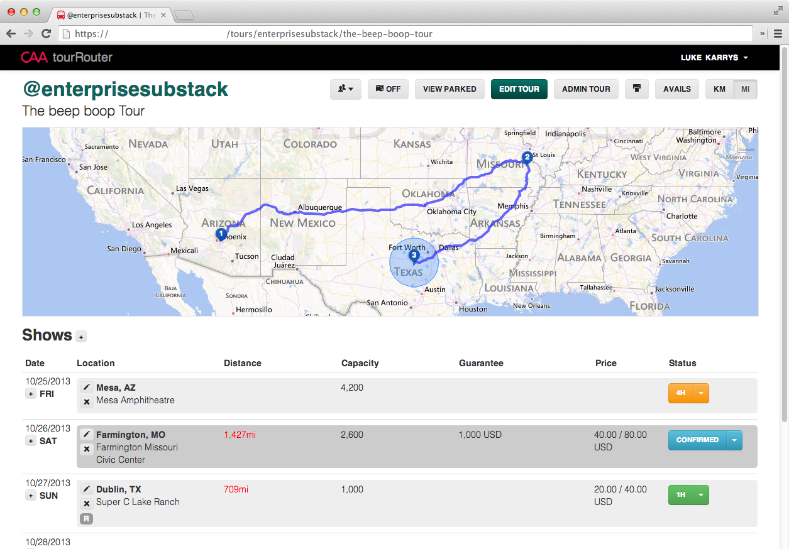

<!-- slide-attributes: class="tight" -->
## Client Solutions from <span>Development</span> to <span>Production</span>

[](http://andyet.com)

<a style="top: -30px" href="http://twitter.com/lukekarrys">Luke Karrys</a>

[](http://caa.com)

<a style="top: -30px" href="http://twitter.com/glennsc">Glenn Scott</a>


---


## <span>tour</span>Router

Notes:
- An app to help agents/assistants/artists/managers collaborate on all aspects of routing a tour around the world


---


<!-- slide-attributes: class="no-padding" -->



---


## <span>tour</span>Router

- Single page app (**SPA**)
- App is served by **Node**
- Built on a **Node API**
- Just an **API Client**
- Deployed to **Azure**

[](http://nodejs.org/) [](http://windowsazure.com)

Notes:
- Node API + client is all one language, makes developers more productive
- App as an API client is important because it serves as a sanity check to make sure we are properly separating concerns. It also allows us to plan for the future as we could have multiple clients and cross-service apps.


---


## Client <span>Stats</span>

- **9900** lines of custom JS in **113** files
- **1700** lines of jade in **43** files
- **55.1k** lines (1.8MB) of clientside JS
- **3KB** of HTML {.class="fragment"}

Notes:
- Gzips/minifies down to 218KB
- A lot of complexity in a single page app
- We have put a lot of thought into how to keep the development process sane without sacrificing production quality or speed (and vice versa)
- Single page apps can devolve into a mess of code very quickly.
- And what does that look like... 


---


## Our <span>HTML</span>

<pre><code>&lt;!DOCTYPE html&gt;
  &lt;html&gt;
  &lt;head&gt;
    &lt;title&gt;tourRouter&lt;/title&gt;
    &lt;!-- Meta tags... --&gt;
    &lt;!-- Splash images... --&gt;
    &lt;!-- Favicons and app icons... --&gt;
    &lt;link rel="stylesheet" href="/app.fd504f36.css"&gt;
    &lt;script src="/app.647efd62.js"&gt;&lt;/script&gt;
</code></pre>
&nbsp;

Notes:
- This acts as our cache manifest file. I'll show you how later.
- The importants bits are the css and js files, each named uniquely


---


## The Team<span>(s)</span>

API &amp; Ops  
**Los Angeles**  


Web App: 2 devs  
**Washington, Arizona**  


Notes:
- Clear separation of concerns between teams
- Async communication because of remote
- Real app with real deadlines and stakeholders
- We needed to ship often, rapidly iterate and make deadlines


---


## The <span>Front-End</span>
- [Moonboots](https://github.com/HenrikJoreteg/moonboots) {.class="fragment"}
- [Express](https://github.com/visionmedia/express)/[Resource](https://github.com/visionmedia/express-resource) {.class="fragment"}
- [Browserify](https://github.com/substack/node-browserify) {.class="fragment"}
- [npm](https://npmjs.org/) {.class="fragment"}
- [Jade](https://github.com/visionmedia/jade)/[Templatizer](https://github.com/HenrikJoreteg/templatizer) {.class="fragment"}
- [Backbone](http://backbonejs.org/) {.class="fragment"}
- [Human JavaScript](http://docs.humanjavascript.com/) {.class="fragment"}

Notes:
- Moonboots is a set of conventions on the server for SPAs. It provides what we need to do caching, minifying, concatenation of assets as well as helpers for routing. It's also very environment aware with sane defaults for development and production.
- Browserify powers much of moonboots and gives us module on the client.
- npm is where we try to get all of our JS from
- Human Javascript is patterns of large client side apps. Powered by backbone it provides extensions for models, views and collections and helpers to connect all three.
- The importants part isn't the tech, but the patterns the tech allows us to follow easily


---


## Dev <span>Process</span>
- **Don't** sacrifice for production performance
- **Guaranteed** cache priming/busting
- <span class="align">Fast **iteration** loops on</span>
  <span class="stack-holder align align-left" style="width: 400px;">
    <span data-fragment-index="1" class="stack fragment fade-out">local</span>
    <span data-fragment-index="1" class="stack fragment fade-in"><span data-fragment-index="2" class="fragment fade-out">mobile</span></span>
    <span data-fragment-index="2" class="stack fragment fade-in"><span data-fragment-index="3" class="fragment fade-out">development</span></span>
    <span data-fragment-index="3" class="stack fragment fade-in"><span data-fragment-index="4" class="fragment fade-out">staging</span></span>
    <span data-fragment-index="4" class="stack fragment fade-in">production</span>
  </span>

Notes:
- I've been on project where production was what everything was optimizied for, to the point that developers had to jump through hoops to develop locally.
- Fast iteration (for all environments and deviced)
- How long does it take me to reload this page?
- How long until I can see this against real data?
- How long until I can test on my iPhone?
- Local === seconds, Dev === minutes, Staging === 10 minutes, Production === 30 minutes
- Guaranteed caching
- Did my change show when I just refreshed? If not, how can I be sure it will next time?
- One of the biggest pains as a developer is when you don't trust the process. I've been on projects where I was never sure if when I refreshed if I was seeing my latest changes. This conditioned me to worry about that and not on my code.


---


## Dev <span>Environment</span>
- Switches on **`process.env.NODE_ENV`**
- Concatenates **non-CommonJS** files
- Builds a **Browserified** bundle
- **`onBeforeJS`** &amp; **`onBeforeCSS`** hooks


Notes:
- Moonboots is very optimized for developer environment without sacrificing anything in production
- NODE_ENV allows us to easily switch defaults (minify, cache, etc) based on environment
- Support for CommonJS incompatible files (jQuery, jQuery plugins) is nice (but we like CommonJS stuff a lot)
- Browserify provides the magic of an entry file, custom modules, and 3rd party modules into one bundle
- We run a fn to build jade -> vanilla JS functions in the hook
- Build on each request guarantees dev is never looking at stale code


---


## Use a <span>Module Pattern</span>
- We use **CommonJS/Browserify**
- Others use **AMD/RequireJS**
- Use **something**
- <span class="align">Structure</span> 
  <span class="stack-holder align" style="width: 235px;">
    <span data-fragment-index="1" class="stack fragment fade-out">collections</span>
    <span data-fragment-index="1" class="stack fragment fade-in"><span data-fragment-index="2" class="fragment fade-out">views</span></span>
    <span data-fragment-index="2" class="stack fragment fade-in"><span data-fragment-index="3" class="fragment fade-out">models</span></span>
    <span data-fragment-index="3" class="stack fragment fade-in"><span data-fragment-index="4" class="fragment fade-out">helpers</span></span>
    <span data-fragment-index="4" class="stack fragment fade-in"><span data-fragment-index="5" class="fragment fade-out">pages</span></span>
    <span data-fragment-index="5" class="stack fragment fade-in">templates</span>
  </span>
  <span class="align">as modules</span>
- <span class="align">Saner</span> 
  <span class="stack-holder align align-left" style="width: 400px;">
    <span data-fragment-index="6" class="stack fragment fade-out">development</span>
    <span data-fragment-index="6" class="stack fragment fade-in"><span data-fragment-index="7" class="fragment fade-out">refactoring</span></span>
    <span data-fragment-index="7" class="stack fragment fade-in"><span data-fragment-index="8" class="fragment fade-out">reuse</span></span>
    <span data-fragment-index="8" class="stack fragment fade-in">overall process</span>
  </span>

Notes:
- CommonJS (and Browserify) fit our use case very well. The build step is seamless and unknown to the developer.
- We structure everything as modules
- Makes it very easy to spec out a model/view/template and refactor later into more reusable parts


---


## Use <span style="text-transform: lowercase">npm</span>
- Install clientisde code from **npm**
- <span class="align">`npm install`</span> 
  <span class="stack-holder align" style="width: 250px;">
    <span data-fragment-index="1" class="stack fragment fade-out">`backbone`</span>
    <span data-fragment-index="1" class="stack fragment fade-in"><span data-fragment-index="2" class="fragment fade-out">`async`</span></span>
    <span data-fragment-index="2" class="stack fragment fade-in"><span data-fragment-index="3" class="fragment fade-out">`lodash`</span></span>
    <span data-fragment-index="3" class="stack fragment fade-in">`moment`</span>
  </span>
  <span class="align">` --save`</span>
- Moonboots can handle **anything else**
- Send [Univeral Module Definition](https://github.com/umdjs/umd/blob/master/returnExports.js) **PRs :)**

Notes:
- As much as possible we try to get clientside libraries from npm
- Reusable between server and client
- Extremely easy to find and get a module into your dev and production envs
- We are not restricted. Moonboots can handle non CommonJS modules. But it is so much nicer to use all code from npm.


---


## Clientside <span>Modules</span>

### From <span>Our Code</span>
<span class="align">`var`</span>
<span class="stack-holder align" data-fragment-counter style="width: 300px;">
  <span data-fragment-index="1" class="stack fragment fade-out">`BasePage`</span>
  <span data-fragment-index="1" class="stack fragment fade-in"><span data-fragment-index="2" class="fragment fade-out">`geospatial`</span></span>
  <span data-fragment-index="2" class="stack fragment fade-in"><span data-fragment-index="3" class="fragment fade-out">`ShowModel`</span></span>
  <span data-fragment-index="3" class="stack fragment fade-in">`templates`</span>
</span>
<span class="align">`=`</span><br/>
<span class="align">`require('`</span>
<span class="stack-holder align" style="width: 400px;">
  <span data-fragment-index="1" class="stack fragment fade-out">`../pages/base`</span>
  <span data-fragment-index="1" class="stack fragment fade-in"><span data-fragment-index="2" class="fragment fade-out">`../helpers/geo`</span></span>
  <span data-fragment-index="2" class="stack fragment fade-in"><span data-fragment-index="3" class="fragment fade-out">`../models/show`</span></span>
  <span data-fragment-index="3" class="stack fragment fade-in">`../templates`</span>
</span>
<span class="align">`')`</span>

---

### From <span>node_modules/</span>

<span class="align">`var`</span>
<span class="stack-holder align" data-fragment-counter style="width: 300px;">
  <span data-fragment-index="4" class="stack fragment fade-out">`_`</span>
  <span data-fragment-index="4" class="stack fragment fade-in"><span data-fragment-index="5" class="fragment fade-out">`Backbone`</span></span>
  <span data-fragment-index="5" class="stack fragment fade-in"><span data-fragment-index="6" class="fragment fade-out">`moment`</span></span>
  <span data-fragment-index="6" class="stack fragment fade-in">`async`</span>
</span>
<span class="align">`=`</span><br/>
<span class="align">`require('`</span>
<span class="stack-holder align" style="width: 300px;">
  <span data-fragment-index="4" class="stack fragment fade-out">`lodash`</span>
  <span data-fragment-index="4" class="stack fragment fade-in"><span data-fragment-index="5" class="fragment fade-out">`backbone`</span></span>
  <span data-fragment-index="5" class="stack fragment fade-in"><span data-fragment-index="6" class="fragment fade-out">`moment`</span></span>
  <span data-fragment-index="6" class="stack fragment fade-in">`async`</span>
</span>
<span class="align">`')`</span>


Notes:
- Clientside code as **Node-style** modules
- Now that we have a common pattern for code we right and modules we use, they can all be required the same way.
- The only difference is we use relative paths for our modules
- Browserify does the rest of the magic using npm's logic for lookups within node_modules dir
- We now have reusable components for every part of our app


---


## A <span>Client</span> Page


```javascript
// pages/saveShow.js
var Page = require('./base'); // Our base page module
var Show = require('../models/show'); // Our show module
var async = require('async'); // async, from npm

// Exporting our saveShow page module
module.exports = P.extend({
  initialize: function () {
    this.model = new Show();
  },
  render: function () { async.each( /* ...stuff... */ ); }
});
```

Notes:
- We include a base component
- and a model
- and async from npm
- and we extend our base module and add functionality


---


## Continuous <span>Deployments</span>

A commit is a **deploy**  
  
A branch is an **environment**  


Notes:
- Someone will know somewhere when a deployment doesn't work
- Code is real once its running on someone else's machine


---


## Continuous <span>Deployments</span>

&nbsp;

> "Works on my machine"
> <small>**Nobody**</small>

Notes:
- Nobody is committing code and not knowing if it works when deployed


---


## All <span>JS</span>

- Node **API**, Node **App**
- Developer productivity**++**
- Devs can add features **top to bottom**

 {.class="fragment"}

Notes:
- Developers can jump back and forth between the two with minimal context switching
- I was able to hop from the app to the API to implement pusher support from the API down to the app
- Even though we had separate teams for the app and API it is still so great to be able to add a feature to the API and app when necessary
- As you can see I was able to commit 21 times to the API, even though thats not a huge amount, I was still able to fix some bugs and add features during my normal workflow which was highly valuable to the team as a whole


---


## Prod <span>Environment</span>
- **Minifies** by default
- **Caches** for 1 year
- Filename **hashed** based on contents
- <span class="align">`GET /app.`</span> 
  <span class="stack-holder align" style="width: 217px;">
    <span data-fragment-index="2" class="stack fragment fade-out">`fd504f36`</span>
    <span data-fragment-index="2" class="stack fragment fade-in">`647efd62`</span>
  </span>
  <span class="align">`.js `</span>
  <span class="stack-holder align align-left" data-fragment-counter style="width: 350px;">
    <span data-fragment-index="1" class="stack fragment fade-out">`200`</span>
    <span data-fragment-index="1" class="stack fragment fade-in"><span data-fragment-index="2" class="fragment fade-out">`(from cache)`</span></span>
    <span data-fragment-index="2" class="stack fragment fade-in"><span data-fragment-index="3" class="fragment fade-out">`200`</span></span>
    <span data-fragment-index="3" class="stack fragment fade-in">`(from cache)`</span>
  </span>
- Application code is on the **device**


Notes:
- Minifies and gzips out code from 1.8MB to 218KB
- We cache for a full year with the confidence that when we deploy, if the hash of the file changes, the filename will change.
- It's not even doing an HTTP request. It just executes the code.
- So the user has almost all of the application code stored on the device and is just requesting and responding to API data.
- The end result is no request after the first one and no latency for the bulk of the application code


---


## Everyone is **happy**

- Developers love the <strong class="fragment">process</strong>
- Users love the <strong class="fragment">speed</strong>
- Stakeholders love the <strong class="fragment">timeline</strong>

Notes:
- As a developer im able to develop from dev to production easily and focus on the harder issues
- Users have a fast app on all platforms
- Stakeholders get rapid iteration and something great that is built quickly


---


## Thank You!
### <span>Follow us on Twitter</span>


[@lukekarrys](https://twitter.com/lukekarrys) [@andyet](https://twitter.com/andyet)

[@glennsc](https://twitter.com/glennsc)